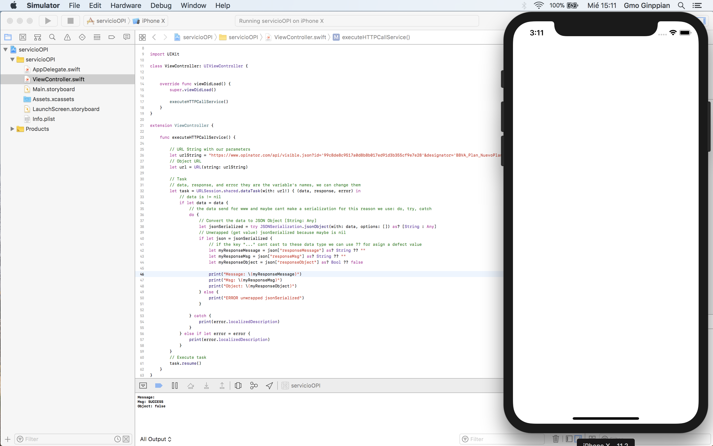

Basic HTTP Get JSON with URLSession Swift 
===

## Description

Now describe a basic implementation of URLSession and JSON.

## Code

```Swift
//
//  ViewController.swift
//  servicioOPI
//
//  Created by Gmo Ginppian on 20/12/17.
//  Copyright © 2017 BUAP. All rights reserved.
//

import UIKit

class ViewController: UIViewController {
    
    
    override func viewDidLoad() {
        super.viewDidLoad()
        
        executeHTTPCallService()
    }
}

extension ViewController {
    
    func executeHTTPCallService() {
        
        // URL String with our parameters
        let urlString = "https://www.opinator.com/api/visible.json?id='99c8de8c9517a0d8b8b017ed91d3b355cf9e7e28'&designator='BBVA_Plan_NuevoPlan'"
        // Object URL
        let url = URL(string: urlString)
        
        // Task
        // data, response, and error they are the variable's names, we can change them
        let task = URLSession.shared.dataTask(with: url!) { (data, response, error) in
            // data is != nil
            if let data = data {
                // the data send for www and maybe cant make a serialization for this reason we use: do, try, catch
                do {
                    // Convert the data to JSON Object [String: Any]
                    let jsonSerialized = try JSONSerialization.jsonObject(with: data, options: []) as? [String : Any]
                    // Unwrapped (get value) jsonSerialized because maybe is nil
                    if let json = jsonSerialized {
                        // if the key "..." cant cast to these data type we can use ?? for asign a defect value
                        let myResponseMessage = json["responseMessage"] as? String ?? ""
                        let myResponseMsg = json["responseMsg"] as? String ?? ""
                        let myResponseObject = json["responseObject"] as? Bool ?? false
                        
                        print("Message: \(myResponseMessage)")
                        print("Msg: \(myResponseMsg)")
                        print("Object: \(myResponseObject)")
                    } else {
                        print("ERROR unwrapped jsonSerialized")
                    }

                } catch {
                    print(error.localizedDescription)
                }
            } else if let error = error {
                print(error.localizedDescription)
            }
        }
        // Execute task
        task.resume()
    }
}
```

<p align="center">
	
</p>

## Font

* <a href="https://www.twilio.com/blog/2017/08/how-to-make-http-requests-in-swift-3.html">Make HTTP Request Swift</a>

* <a href="https://stackoverflow.com/questions/24034483/what-is-an-unwrapped-value-in-swift">Unwrapped</a>
